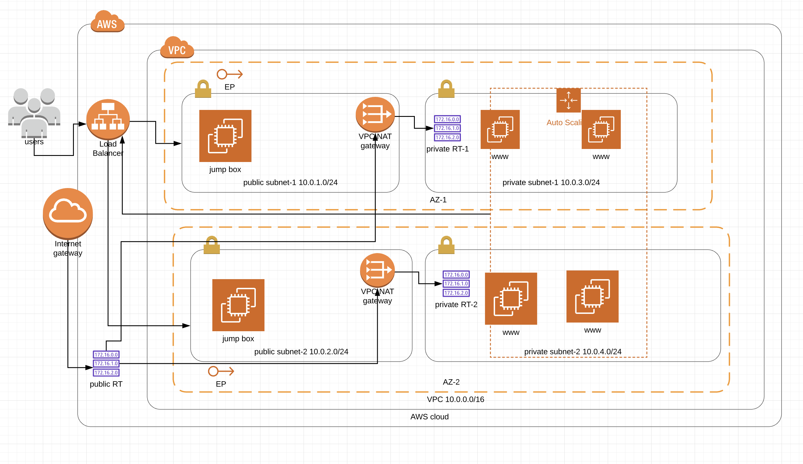

# High Availability Application Deployment on AWS

This repository contains Terraform configurations to deploy a highly available application on AWS using load balancers, auto-scaling, and other AWS services. The deployment process includes creating a Virtual Private Cloud (VPC), setting up load balancers, configuring auto-scaling groups, and deploying the application.

## Infrastructure Diagram



The infrastructure diagram illustrates the architecture of the deployed application, including the networking components, load balancers, auto-scaling groups, and other relevant AWS services.

## Deployment Steps

To deploy the application on AWS, follow these steps:

1. Clone this repository to your local machine:
```bash
git clone <repository-url>
```

2. Navigate to the cloned repository:
```bash
cd <repository-directory>
```

3. Initialize Terraform:
```bash
terraform init
```

4. Review the Terraform configurations in the repository, including variables and resource definitions, to ensure they meet your requirements.

5. Modify the `terraform.tfvars` file to customize configuration values such as region, instance types, and other parameters as needed.

6. Apply the Terraform configurations to create the infrastructure:
```bash
terraform apply
```

7. Confirm the changes and enter `yes` when prompted to apply the Terraform changes.

8. Once the deployment is complete, verify that the application is accessible via the load balancer URL.

## Directory Structure

- `main.tf`: Contains the main Terraform configuration defining the infrastructure components.
- `variables.tf`: Defines input variables used in the Terraform configurations.
- `terraform.tfvars`: Contains variable values for configuring the deployment.
- `outputs.tf`: Defines output values to display after the Terraform deployment.
- `assets/`: Directory containing additional assets, such as infrastructure diagrams.

## Contributions

Contributions to enhance or improve this repository are welcome. If you encounter any issues or have suggestions for improvements, please open an issue or pull request on GitHub.

## License

This project is licensed under the [MIT License](LICENSE). Feel free to modify and distribute the code for your own purposes.
